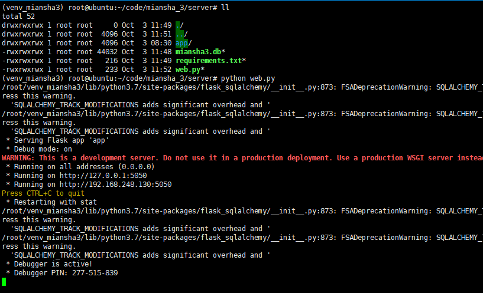

<!--
 * @Author: Recar
 * @Date: 2022-10-03 07:59:31
 * @LastEditors: Recar
 * @LastEditTime: 2022-10-07 20:49:31
-->
# 简单的远控实现demo

一个心跳请求实现命令请求 命令结果回传 demo版

## 启动服务端

## 启动被控端

这时可以在服务端看到心跳

## 浏览器访问服务端

可以看到 注册的客户端

## 执行命令

点击操作

输入命令 ipconfig 点击提交 会显示命令执行中

等待会可以看到完整的结果

## 修改下次上传时间

默认是3s 

执行命令 sleep 10 修改延迟时间为10s

这时再执行命令就要等10s才会有结果 

## 数据上传

数据上传和心跳是一个请求

每次心跳会带上一次命令执行的结果以及下一次是否有需要执行的命令
